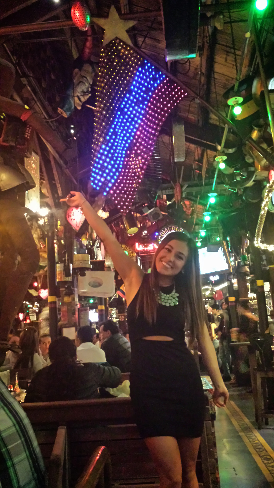
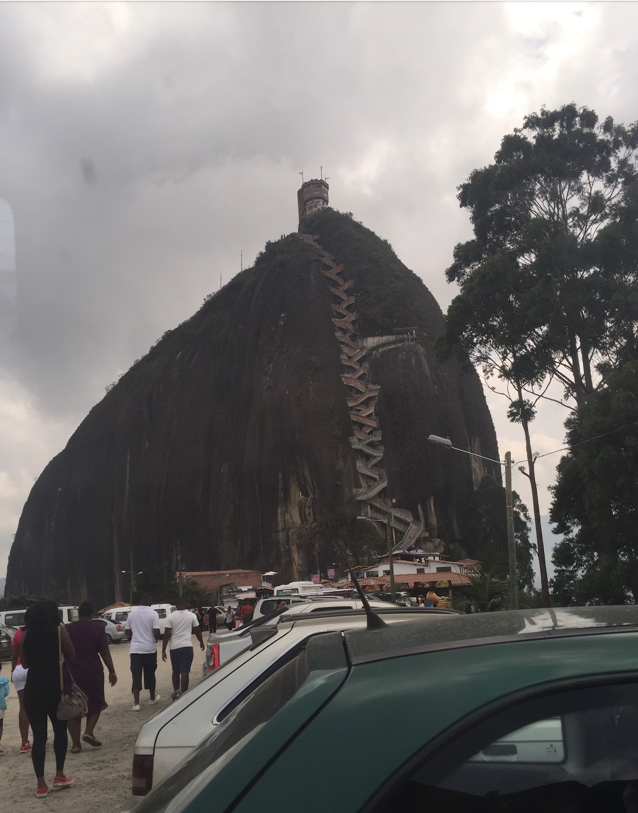
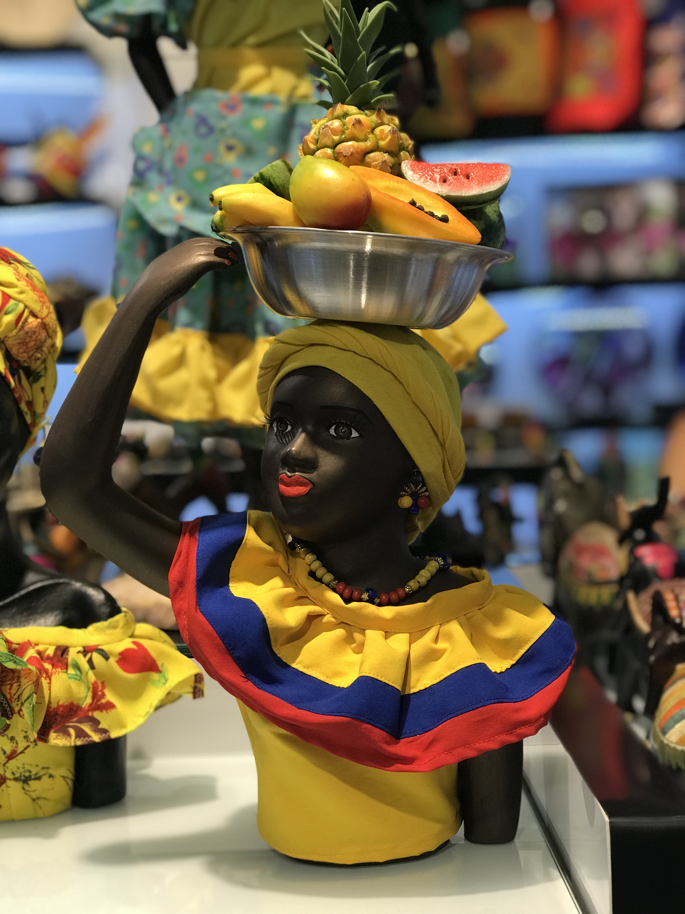
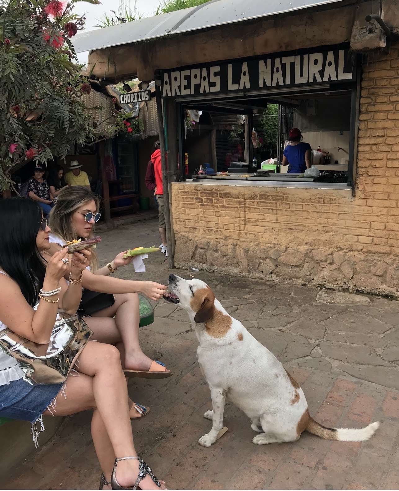

Nothing better than being in your native Country.

Where do we start? so many beautiful cities to visit. Starting in Bogota (which is where you will most likely fly in to), Medellin (where J. Balvin, Karolg G and Maluma are from), Cartagena (visiting the walled city and the beautiful beaches) and Bucaramanga (my home town). These are my top favorite cities that I have visited. 

One of the most famous restaurants in Bogota, know for its unique decorations and exiciting enviroment.

Guatape in Medellin is something like you have never seen before.

You will see these beatiful women walking around in their traditional gowns selling goods. 

To finish off, AREPAS. Enough of a reason to visit Bucaramanga.

