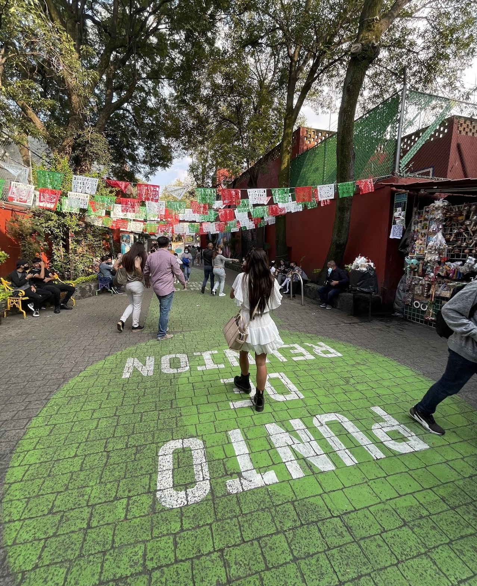

Before going to Mexico I always thought it was overated. Mainly because when I first moved to the states and people saw a brown haired girl that spoke Spanish they automatically thought I was Mexican and well I am NOT, I am Colombian! Overtime I grew anger towards Mexico and Mexicans(no offence to anyone). The irony of all this is that I am now married to a Mexican and my daughter is half Mexican. Funny how life works. With that being said, I LOVE MEXICO. 
There are so many places to discover and the best part of it is that its fast and easy to get there; to most places is just a direct flight! who doesnt like direct flights, specially to another country.
I will share below my top things/places to visit in Mexico City.

1.  Go to a Game at the Azteca Stadium

2.  Visit Bellas Artes

3.  Explore Coyoacan

4.  Live the experiance of Las Trajineras

